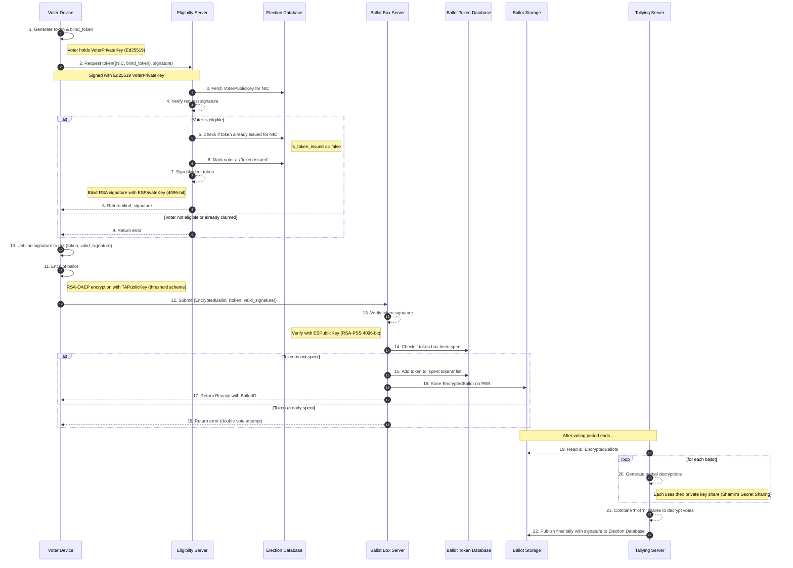

# Election System Core

A secure, privacy-preserving electronic voting system built with TypeScript and NestJS, implementing blind signatures, threshold cryptography, and end-to-end ballot encryption.

## Overview

This workspace contains three core servers and shared cryptographic libraries that work together to provide a secure voting infrastructure.  The system ensures voter anonymity through blind signature tokens while maintaining vote integrity and auditability. 

## Key Features

- **Voter Anonymity**: Blind RSA signatures prevent linking voter identity to their ballot
- **Vote Privacy**: End-to-end encryption using RSA-OAEP with threshold decryption
- **Double-Vote Prevention**: Spent token tracking ensures one vote per eligible voter
- **Threshold Security**: Private key shares distributed across multiple parties (t-of-n threshold scheme)
- **Digital Signatures**: Ed25519 signatures for voter authentication

## Technology Stack

- **Framework**: NestJS with TypeScript
- **Database**: PostgreSQL with TypeORM
- **Cryptographic Libraries**:
  - `@cloudflare/blindrsa-ts` - Blind RSA signatures (RSA-BSSA with SHA-384/PSS)
  - `tweetnacl` - Ed25519 digital signatures
  - `secrets.js-grempe` - Shamir's Secret Sharing for threshold cryptography
  - Node.js `crypto` module - AES-256-GCM encryption and RSA-OAEP

## Cryptographic Architecture

### 1. **Blind RSA Signatures** (`libs/crypto/src/blind-rsa.ts`)
- **Algorithm**: RSA-BSSA (Blind Signature Scheme with Appendix)
- **Variant**: SHA384. PSS. Randomized
- **Key Size**: 4096-bit RSA keys
- **Purpose**: Issues unlinkable voting tokens to eligible voters

**How it works**:
1. Voter blinds a random token using the Eligibility Server's public key
2. Server signs the blinded token without seeing the original
3. Voter unblinds the signature to get a valid token
4. Token can be verified by Ballot Box Server without revealing voter identity

### 2. **Ed25519 Digital Signatures** (`libs/crypto/src/ed25519.ts`)
- **Library**: TweetNaCl
- **Purpose**:  Voter device authentication during eligibility requests
- **Features**:  Fast, compact signatures with strong security guarantees

### 3. **Threshold Cryptography** (`libs/crypto/src/threshold.ts`)
- **Algorithm**: Shamir's Secret Sharing with RSA-OAEP
- **Configuration**: 5 shares, threshold of 3 (configurable)
- **Key Size**: 2048-bit RSA with SHA-256
- **Purpose**:  Distribute tallying server's private key across multiple parties
- **Benefit**: No single party can decrypt ballots alone

### 4. **AES-GCM Encryption** (`libs/crypto/src/aes. ts`)
- **Algorithm**: AES-256-GCM
- **Key Size**: 256-bit
- **IV Size**: 96-bit (recommended for GCM)
- **Purpose**: Authenticated encryption for auxiliary data

### 5. **Key Management** (`libs/crypto/src/key-store.ts`)
- **RSA-PSS Keys**: 4096-bit for blind signatures
- **RSA-OAEP Keys**:  2048-bit for ballot encryption
- **Format**: PEM-encoded keys (PKCS#8 for private, SPKI for public)
- **Storage**: File-based with secure permissions (0o600)

## Architecture Diagram


## Security Flow

### Voting Process (Sequence Diagram)



## Project Structure

```
election-system-core/
├── apps/
│   ├── eligibility-server/     # Issues blind-signed tokens to eligible voters
│   ├── ballot-box-server/      # Accepts and stores encrypted ballots
│   └── tallying-server/        # Decrypts ballots using threshold keys
├── libs/
│   ├── crypto/                 # Cryptographic library
│   │   ├── blind-rsa.ts       # Blind RSA signature operations
│   │   ├── ed25519.ts         # Digital signature operations
│   │   ├── aes.ts             # AES-GCM encryption
│   │   ├── threshold.ts       # Shamir's Secret Sharing
│   │   └── key-store. ts       # Key generation and management
│   ├── database/              # TypeORM entities and repositories
│   └── shared/                # Common utilities and config
└── package.json
```

## Getting Started

### Prerequisites

- Node.js 18+ 
- PostgreSQL 14+
- npm or yarn

### Installation

```bash
npm install
```

### Running the Servers

Start individual servers from the repository root:

```bash
# Eligibility Server (Port 3001)
npm run start:eligibility

# Ballot Box Server (Port 3002)
npm run start:ballot

# Tallying Server (Port 3003)
npm run start:tally

# Or start all concurrently
npm run start:all
```

### Key Generation

Keys are automatically generated on first startup:

- **Eligibility Server**:  Generates 4096-bit RSA-PSS keypair for blind signatures
- **Tallying Server**: Generates 2048-bit RSA-OAEP keypair and splits into 5 shares (threshold:  3)

Keys are stored in `apps/{server-name}/secrets/` directory with secure file permissions. 

## Security Considerations

### Implemented Security Measures

**Unlinkability**: Blind signatures prevent linking voter to ballot  
**Vote Secrecy**: End-to-end encryption with threshold decryption  
**Double-voting Prevention**: Spent token tracking  
**Key Distribution**: Threshold cryptography (no single point of failure)  
**Authenticated Encryption**: AES-GCM provides confidentiality and integrity  
**Digital Signatures**: Ed25519 for fast, secure authentication

### Important Notes

This system is a minimal scaffold for local development and demonstration purposes  

## Development

```bash
# Format code
npm run format

# Lint code
npm run lint

# Run tests
npm test

# Build all projects
npm run build
```
