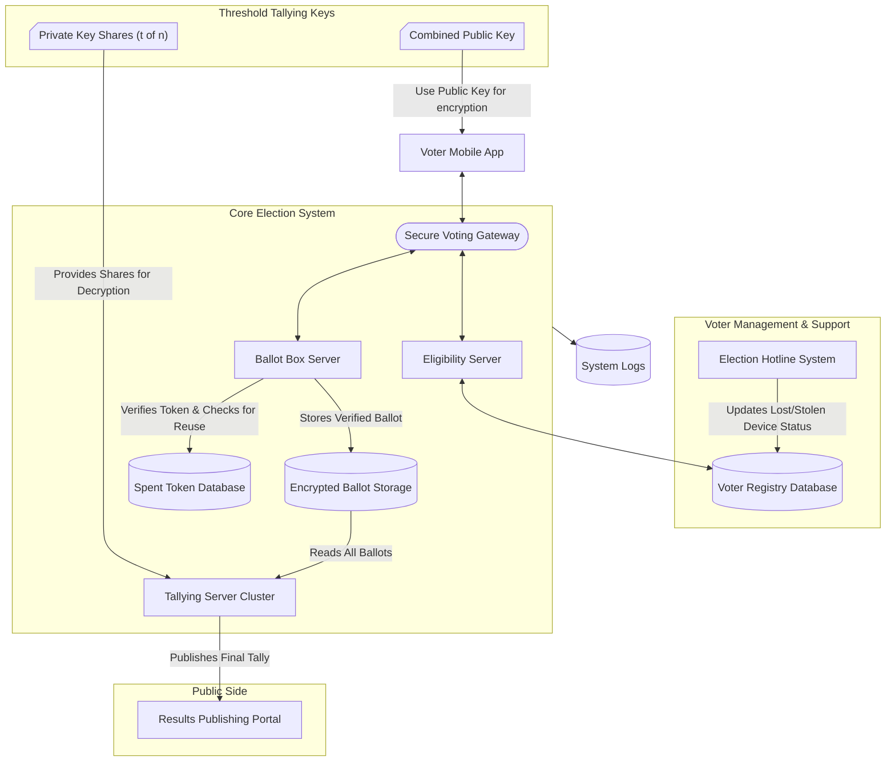
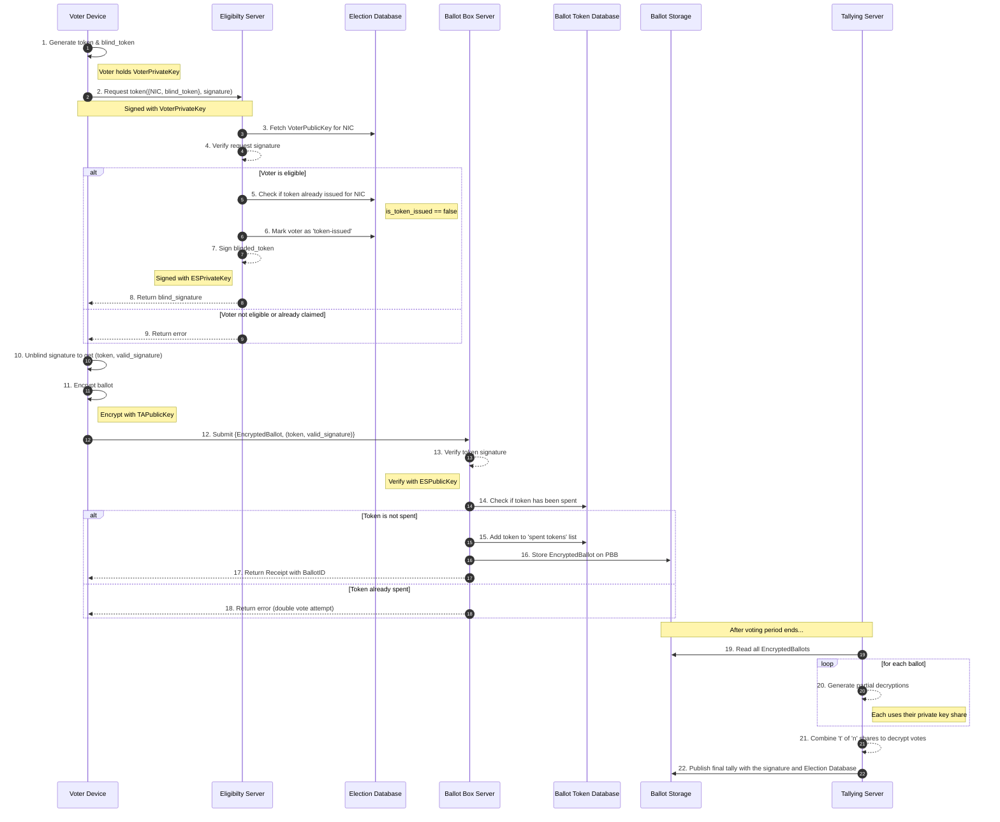

# Election System Core

This workspace contains three servers and a shared helper module.

## Architecture Diagram



## Sequence Diagram



Start individual servers from the repository root:

```powershell
# eligibility
npm --workspace servers/eligibility-server run start

# ballot box
npm --workspace servers/ballot-box-server run start

# tallying
npm --workspace servers/tallying-server run start

# or start all concurrently (root script)
npm run start:all
```

Notes:

- These servers are minimal scaffolds for local development and demo only.
- They use `shared/index.js` for basic config loading and logging.
